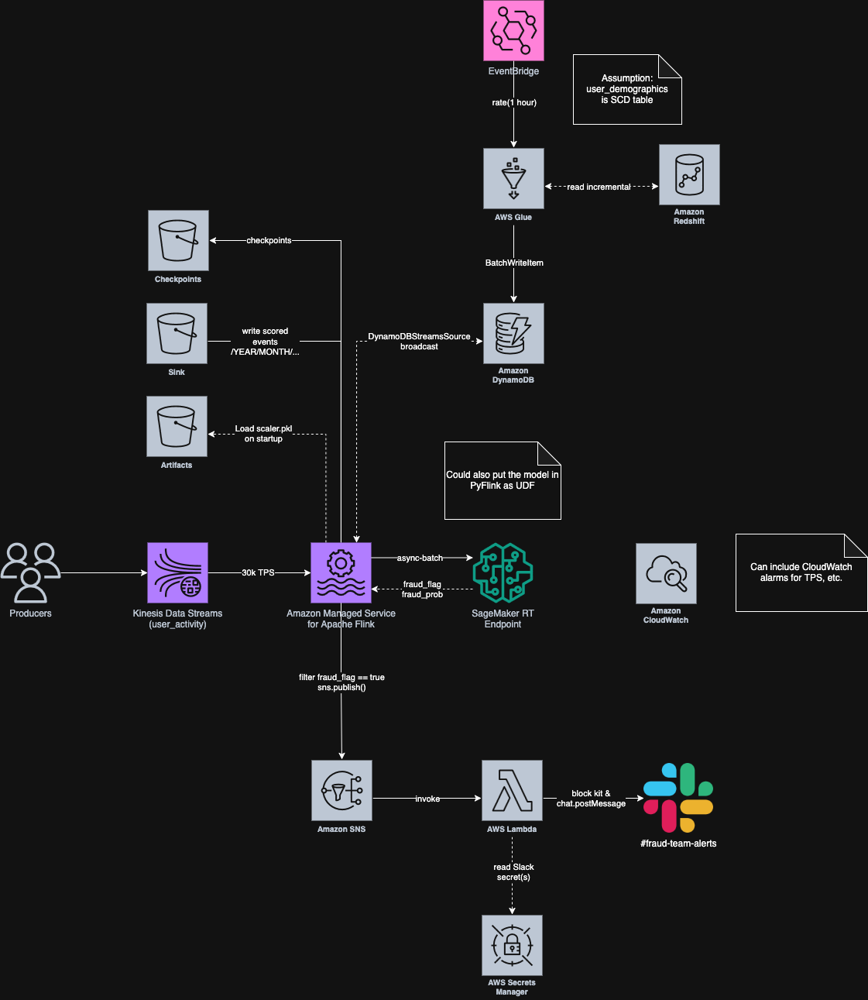
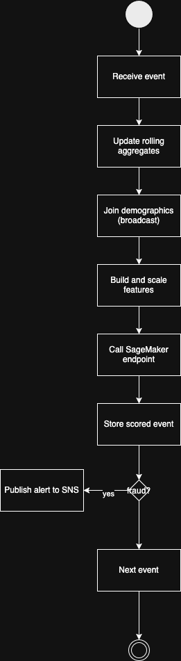

# Fraud API task

## Architecture Overview



## E2E

> **Kinesis** ingests raw transactions -> **Flink** performs joins + rolling aggregates and calls **SageMaker** -> the result published to **SNS** to a **Lambda** that formats **Slack** alerts. Scored events land in **S3** for analytics.

## Components

### Ingestion

Kinesis is used to ingest transactions.

### Stream Processor (Amazon Managed Service for Apache Flink)



#### Stream Processor Trade Offs

Flink is chosen for its lower latency and better performance for real-time streaming applications.
I have hit shuffle issues with Spark Structured Streaming in the past, and Flink keyed state
is a great fit for this use case.

> NOTE: The architecture can be implemented using Spark Structured Streaming instead of Flink, but I have chosen Flink for its lower latency and better performance for real-time streaming applications.
>
> If using Spark, we'd update `user_demographic` by materialising the table and readStream it as a
> streaming source OR periodic static broadcast join every N mins.

#### Feature Scaling

The feature scaling artifact lives in the artifact S3 bucket under a versioned prefix. The streaming application fetches the scaler on startup and keeps it in memory. This means there is zero latency for feature scaling during inference, but it does mean that the scaler needs to be updated
when the model is updated.

Embedding the scaler inside the inference service is possible, but it would couple feature logic
to the model container and breaks separation of concerns.

### Reference Data

I have made the assumption that `user_demographic` is a reference table that is updated periodically
and is not a high veloicity stream. This means we can use a static broadcast join to enrich the
streaming data with user demographic information.

We have a Glue job that updates the `user_demographic` table periodically, and the Flink application
will read the latest version of the table as a static broadcast join via DynamoDB streams.

### Model Inference

The Flink application performs model inference by calling a SageMaker endpoint. The model is
deployed as a container in SageMaker, which allows for easy scaling and management of the model
inference service.

#### Model Inference Trade Offs

- SageMaker is chosen for its managed scaling capabilities and simplified deployment process, and
  decouples the streaming application from the inference service.
- A self-hosted service could be used (e.g. ECS), but it's just a simple model inference service so SageMaker
  is a better fit.
- A user-defined function (UDF) could also be used to perform the inference directly in the
  streaming application. This would couple the inference logic with the streaming application, but
  likely achieve lowest latency.

### Alerting

The Flink application publishes the results of the model inference to an SNS topic. This allows
for decoupling the streaming application from the alerting service, and allows for easy scaling
and management of the alerting service.

The SNS topic is subscribed to a Lambda function that formats the alert and sends it to Slack using
Block Kit + Slack API.

#### Alerting Trade Offs

SNS is used as a buffer to decouple the streaming application from the Lambda function. We could
also directly invoke the Lambda function from the streaming application, but this would
couple the two components and make it harder to scale or change the Lambda function independently.

## FastAPI Service

### Non-Docker

1. Install `uv` ([instructions](https://docs.astral.sh/uv/getting-started/installation/))
2. `uv venv`
3. `source .venv/bin/activate`
4. `uv run main.py`

Invoke the FastAPI service to test the model inference:

```sh
curl -X POST http://localhost:8080/invocations \
  -H 'Content-Type: application/json' \
  -d '{
        "age": 35,
        "gender_code": 1,
        "location": 12,
        "subscription_type_code": 2,
        "tenure_months": 24,
        "income_bracket_code": 1,
        "event_created_at_ts": 1718500000,
        "transaction_value": 149.99,
        "channel_code": 0
      }'
```

### Docker

1. Build the Docker image:

    ```sh
    docker build -t fraud-fastapi .
    ```

2. Run the Docker container:

   ```sh
   docker run -p 8080:8080 fraud-fastapi
   ```

3. Invoke the FastAPI service to test the model inference:

    ```sh
    curl -X POST http://localhost:8080/invocations \
    -H 'Content-Type: application/json' \
    -d '{
            "age": 35,
            "gender_code": 1,
            "location": 12,
            "subscription_type_code": 2,
            "tenure_months": 24,
            "income_bracket_code": 1,
            "event_created_at_ts": 1718500000,
            "transaction_value": 149.99,
            "channel_code": 0
        }'
    ```

## Terraform

I only have implemented the below to demonstrate the architecture.

- `kinesis_stream_ref` Looks up (does **not** create) the existing Kinesis data stream.
- `flink_app` Deploys an Amazon Managed Service for Apache Flink application.
- `sagemaker_rt_endpoint` Spins up a SageMaker **realtime** endpoint for fraud-scoring inference.
- `dynamodb_table` Creates the `user_demographics` table that Glue will update periodically.

Additional modules you’d add for a production rollout

- `s3_buckets` artifact, checkpoint, and model-version buckets
- `sns_topic` central alerting topic
- `lambda_function` formats alerts and sends them to Slack
- `glue_job` hourly ETL that refreshes `user_demographics`
- `cloudwatch` alarms, dashboards, and log groups
- `secrets_manager` stores Slack webhooks, API keys, etc.
- `eventbridge` schedules Glue jobs and other event-driven actions

File layout for each module:

```text
<module>/
  main.tf        # resources
  variables.tf   # input variables
  outputs.tf     # exports
  README.md      # how to use the module
```
